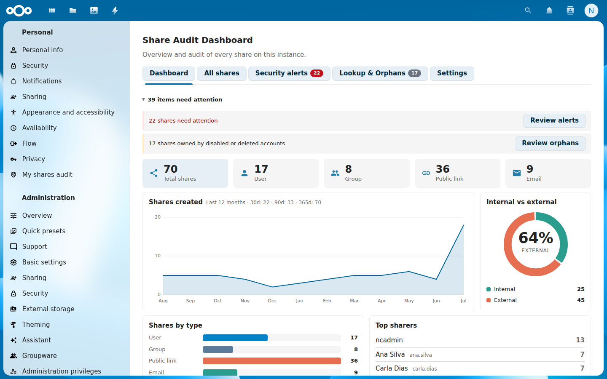
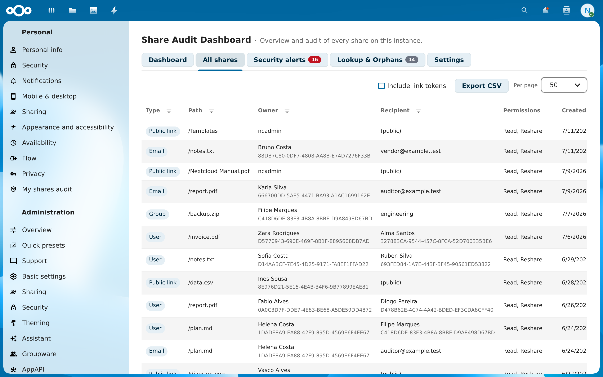
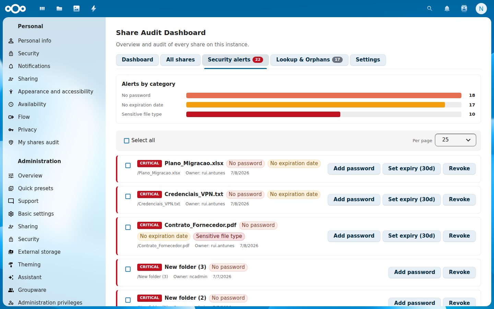
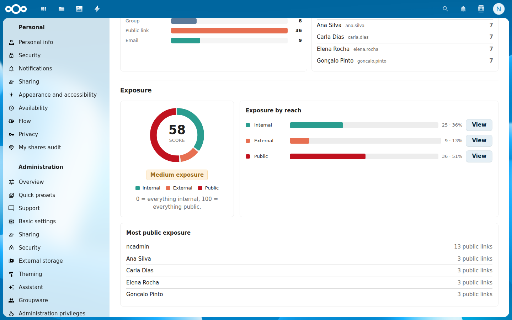
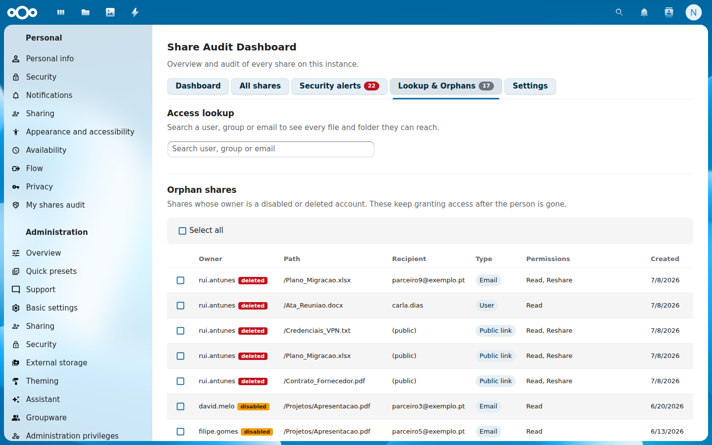
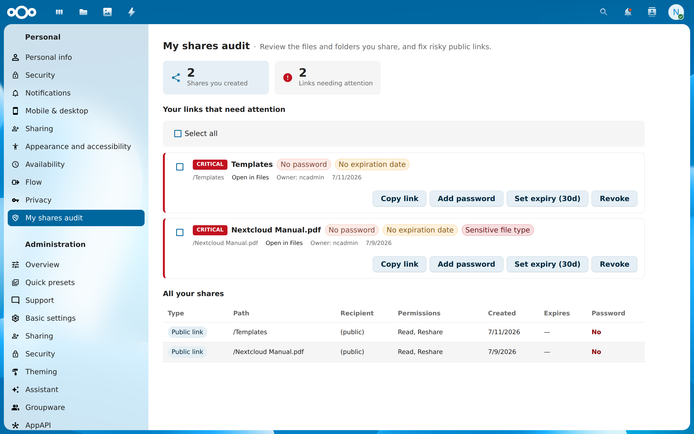
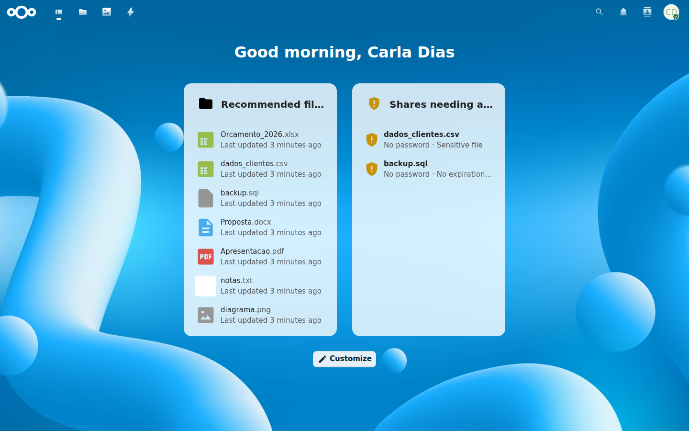

# Share Audit Dashboard for Nextcloud

**See and audit every share on your Nextcloud — in the browser, not the CLI.**

Share Audit Dashboard gives administrators a single, visual overview of every
share on the instance (user, group, public link, email, federated, Talk), flags
the risky ones, and lets you fix them in bulk. Regular users get their own
personal view to audit and clean up the files *they* share.



## Problem Solved

Nextcloud can list shares on the command line (`occ sharing:list`), but there is
no visual, filterable, actionable dashboard — and no easy way to answer
*“who can reach this data?”*, *“which of our public links have no password?”*, or
*“are we still sharing files owned by people who left?”*. Share Audit Dashboard
fills that gap with an admin-wide audit surface and a per-user self-service view.

## Features

### For administrators (Settings → Administration → Share Audit)

- **Dashboard** — totals per share type, a 12‑month creation trend, an
  *internal vs external* exposure section with a 0–100 exposure score, and top
  sharers. Attention banners flag insecure links and orphaned shares. Click a
  stat card or exposure category to jump straight into the filtered list.
- **All shares** — a filterable, sortable, server‑side paginated table of every
  share on the instance. Filters live in the column headers (type, path, owner,
  recipient, password, expiration); every row links straight to the file in
  **Files**. Export the filtered view to **CSV** — public‑link tokens are only
  included with an explicit opt‑in and warning, since a token is a bare
  credential.
- **Security alerts** — five configurable rules: public link with **no
  password**, with **no expiration**, exposing a **sensitive file type**,
  open for **anonymous upload without a password** (file drop), and a group
  share granting **edit/reshare to a large group** (member threshold
  configurable). Links **expiring soon** or **already expired** are flagged
  too. Click a bar in the category breakdown to filter the list; copy the
  public URL or open the file straight from each alert. Fix issues
  individually or in **bulk**: add a generated password, set an expiration
  (7/30/90 days), or revoke.
- **Lookup & Orphans** — search a user, group or email and see **every file and
  folder they can reach** (paginated), with *revoke all access* (built for
  audits and offboarding suppliers); plus shares still owned by **disabled or
  deleted accounts**, with bulk revoke — a classic offboarding risk Nextcloud
  does not surface.
- **Auditable by design** — every revocation made through the app (single,
  bulk, orphan cleanup, revoke‑all) goes through Nextcloud's share manager,
  so federated unshares, activity entries and app hooks all run — and is
  recorded in the audit log when the `admin_audit` app is enabled: who
  revoked what, when.

### For every user (Settings → Personal → My shares audit)

- Review the files and folders **you** share, and fix your own risky public links
  (add password / set expiration / revoke) — scoped strictly to your own shares.
- A **dashboard widget** highlights your links that need attention right on the
  Nextcloud dashboard.
- Admins can turn this personal view (and its widget) off instance-wide from
  **Settings → Administration → Share Audit → Settings**, for instances where
  sharing audits should stay an admin-only concern.

## Installation

### Via App Store (Recommended)
1. Go to **Apps** in your Nextcloud
2. Search for "Share Audit Dashboard"
3. Click **Install**

### Manual Installation
```bash
cd /path/to/nextcloud/apps
git clone https://github.com/kreotropic/share_audit.git share_audit_dashboard
php occ app:enable share_audit_dashboard
```

> **Note:** compiled JavaScript is included in the repository, so `npm install`/`npm run build` are only needed if you modify the frontend source.

## Usage

### Web Interface

- **Admins:** **Settings → Administration → Share Audit** — Dashboard, All shares,
  Security alerts, Lookup & Orphans, and Settings.
- **Users:** **Settings → Personal → My shares audit**.

Everything is available in the browser; there are no OCC commands to learn.

### Bulk fixes on public links

In **Security alerts** (admin) and **My shares audit** (user) you can act on many
links at once: generate a password, set an expiration, or revoke. Generated
passwords are shown **once** — copy them immediately, they are not stored or shown
again.

## Known Limitations

- **Revocations are permanent.** Revoking a share deletes it — there is no
  recycle bin yet (a soft‑delete with restore is the top item on the
  [roadmap](ROADMAP.md)). The confirmation step and the audit‑log trail are
  the current safety nets; double‑check before bulk revokes.

- **It audits Nextcloud shares, not raw filesystem permissions.** The dashboard
  reads the shares Nextcloud records (the `oc_share` table): user, group, public
  link, email, federated and Talk shares. It does not report on external-storage
  native ACLs or OS-level permissions.

- **“Select all” spans the current page.** With server-side pagination, selecting
  all only covers the loaded page. Increase **Per page**, or in Security alerts
  pick **All**, to act across the whole set at once.

- **Generated passwords are shown once.** When a bulk or single "add password"
  action creates a password, copy it right away — it is not shown again.

## Translations

The app interface is available in:

- **English** (default)
- **Portuguese (Portugal)** / Português (Portugal)

Contributions for additional languages are welcome — add a `l10n/<locale>.json`
and regenerate the matching `l10n/<locale>.js` with `python3 build/l10n.py`.

## Requirements

- Nextcloud 31–33
- PHP 8.1 or later

## License

[AGPL‑3.0‑or‑later](LICENSE) © Ricardo Ferreira.

## Development

The frontend is Vue 3 + `@nextcloud/vue`; the backend reads `oc_share` directly
via a mapper and exposes an admin‑only (and a per‑user) JSON API. See the code
under `lib/` and `src/`.

### Frontend build

Compiled JavaScript is committed to the repository, so a build is only needed when
you change the Vue/JS sources under `src/`:

```bash
npm install
npm run build      # production build
npm run watch      # rebuild on change
```

### Translations build

After editing a translation, regenerate the frontend `l10n/*.js` bundles from the
`l10n/*.json` sources (and check for missing/orphaned strings — the scan covers
both the Vue sources under `src/` and the PHP-side `IL10N::t()` calls under
`lib/`):

```bash
python3 build/l10n.py           # regenerate all l10n/<lang>.js
python3 build/l10n.py --check   # fail if strings are missing (also gates packaging)
```

### Tests and CI

```bash
composer install                # dev dependencies (nextcloud/ocp, phpunit)
vendor/bin/phpunit -c phpunit.xml
```

Every push runs the GitHub Actions workflow in `.github/workflows/ci.yml`:
l10n coverage check, PHP lint + unit tests, and the frontend production build.
`krankerl package` runs the l10n check again before building the release
tarball.

## Contributing

Pull requests welcome! Please open an issue first to discuss significant changes.

## Screenshots

| All shares (header filters, CSV export) | Security alerts (bulk fixes) |
|---|---|
|  |  |

| Exposure | Access lookup (who can reach this?) |
|---|---|
|  |  |

| Personal view (My shares audit) | Dashboard widget |
|---|---|
|  |  |

*The snapshots above showcase the admin all-shares table, the security-alerts bulk
fixes, the exposure overview, the access-lookup audit, the per-user personal view,
and the dashboard widget. The App Store listing uses the same images via the
URLs declared in `appinfo/info.xml`.*

## Roadmap

Planned features (alert acknowledgements/exceptions, soft delete / recycle bin
for shares, owner notifications, ownership transfer, email digests and
compliance reports, per-group policies, and more) are documented in
[ROADMAP.md](ROADMAP.md).

## Changelog

See [CHANGELOG.md](CHANGELOG.md) for the full version history.

## Support

- Issues: [GitHub Issues](https://github.com/kreotropic/share_audit/issues)
- Forum: [Nextcloud Community](https://help.nextcloud.com)

## Author

Ricardo Ferreira
