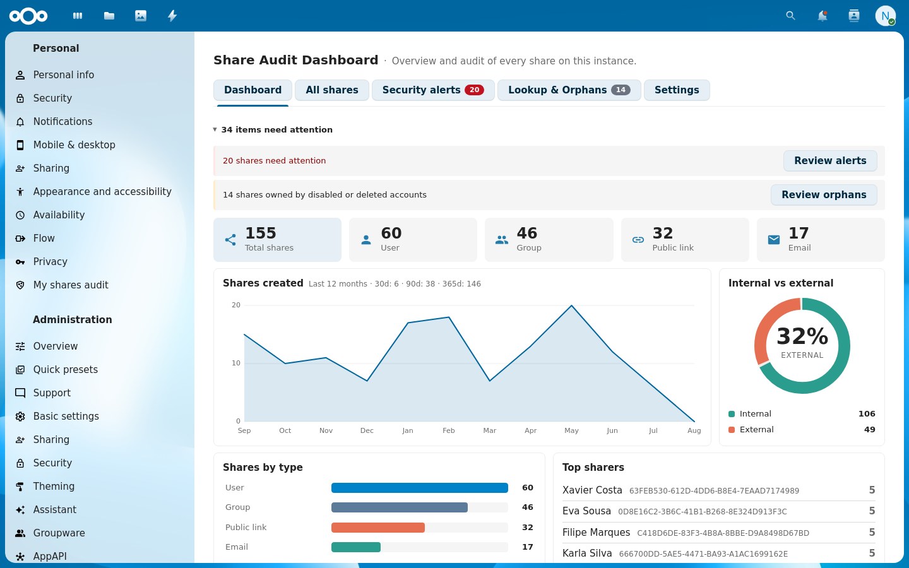
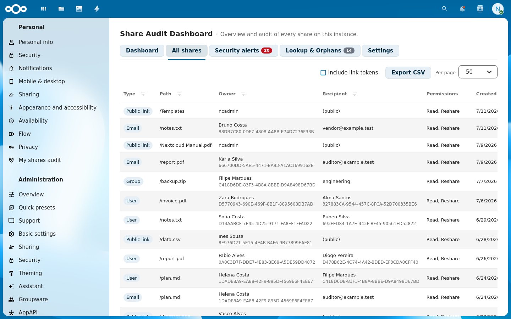
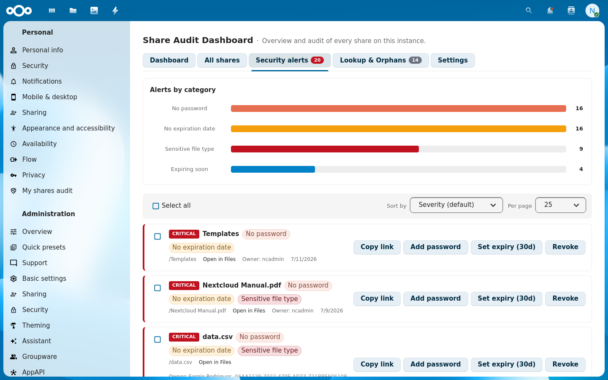
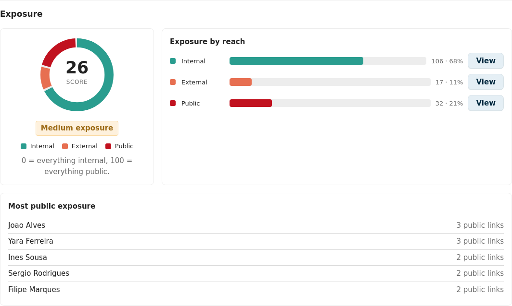
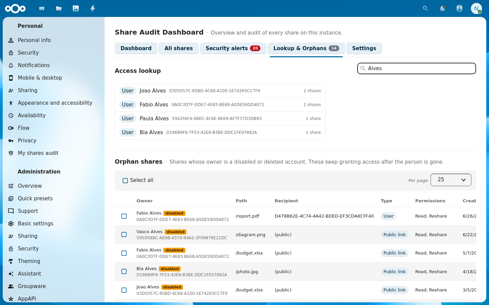
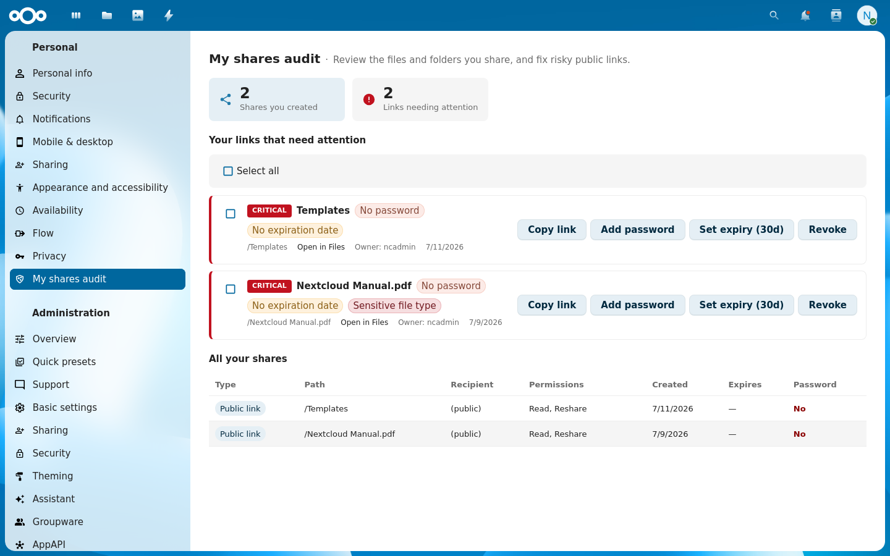
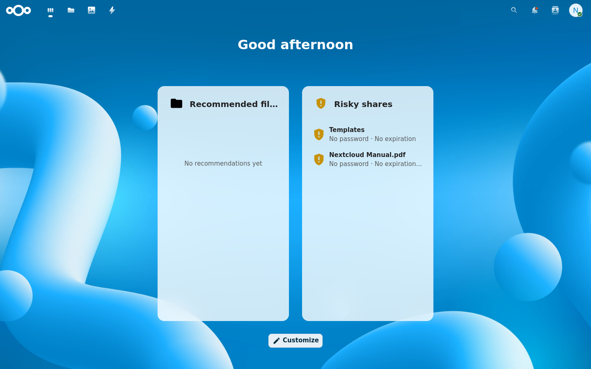

<!--
  - SPDX-FileCopyrightText: 2025 Ricardo Ferreira <rsfneg@gmail.com>
  - SPDX-License-Identifier: AGPL-3.0-or-later
  -->

# Share Audit Dashboard for Nextcloud

**See and audit every share on your Nextcloud — in the browser, not the CLI.**

Share Audit Dashboard gives administrators a single, visual overview of every
share on the instance (user, group, public link, email, federated, Talk), flags
the risky ones, and lets you fix them in bulk. Regular users get their own
personal view to audit and clean up the files *they* share.



## Problem Solved

Nextcloud can list shares on the command line (`occ sharing:list`), but there is
no visual, filterable, actionable dashboard — and no easy way to answer
*“who can reach this data?”*, *“which of our public links have no password?”*, or
*“are we still sharing files owned by people who left?”*. Share Audit Dashboard
fills that gap with an admin-wide audit surface and a per-user self-service view.

## Features

### For administrators (Settings → Administration → Share Audit)

- **Dashboard** — totals per share type, a 12‑month creation trend, an
  *internal vs external* exposure section with a 0–100 exposure score, and top
  sharers. Attention banners flag insecure links and orphaned shares. Click a
  stat card or exposure category to jump straight into the filtered list.
- **All shares** — a filterable, sortable, server‑side paginated table of every
  share on the instance. Filters live in the column headers (type, path, owner,
  recipient, password, expiration). Export the filtered view to **CSV**.
- **Security alerts** — public links with no password, no expiration, or exposing
  a sensitive file type. Fix them individually or in **bulk**: add a generated
  password, set an expiration, or revoke. The alert rules are configurable.
- **Lookup & Orphans** — search a user, group or email and see **every file and
  folder they can reach**, with *revoke all access* (built for audits and
  offboarding suppliers); plus shares still owned by **disabled or deleted
  accounts**, with bulk revoke — a classic offboarding risk Nextcloud does not
  surface.
- **Deleted shares** — a recycle bin for revoked shares. Unsharing in Nextcloud
  is normally immediate and irreversible; here a removed share is kept for a
  retention window (30 days by default, configurable) and can be **restored** or
  purged, individually or in bulk. It catches every removal on the instance, not
  just the ones made through this app — unsharing from the Files app, another
  app, `occ` or the sharing API lands in the bin just the same. A daily
  background job clears out anything past its retention date.

### For every user (Settings → Personal → My shares audit)

- Review the files and folders **you** share, and fix your own risky public links
  (add password / set expiration / revoke) — scoped strictly to your own shares.
- A **dashboard widget** highlights your links that need attention right on the
  Nextcloud dashboard.
- Admins can turn this personal view (and its widget) off instance-wide from
  **Settings → Administration → Share Audit → Settings**, for instances where
  sharing audits should stay an admin-only concern.

## Installation

### Via App Store (Recommended)
1. Go to **Apps** in your Nextcloud
2. Search for "Share Audit Dashboard"
3. Click **Install**

### Manual Installation
```bash
cd /path/to/nextcloud/apps
git clone https://github.com/kreotropic/share_audit.git share_audit_dashboard
php occ app:enable share_audit_dashboard
```

> **Note:** compiled JavaScript is included in the repository, so `npm install`/`npm run build` are only needed if you modify the frontend source.

## Usage

### Web Interface

- **Admins:** **Settings → Administration → Share Audit** — Dashboard, All shares,
  Security alerts, Lookup & Orphans, Deleted shares, and Settings.
- **Users:** **Settings → Personal → My shares audit**.

Everything is available in the browser; there are no OCC commands to learn.

### Bulk fixes on public links

In **Security alerts** (admin) and **My shares audit** (user) you can act on many
links at once: generate a password, set an expiration, or revoke. Generated
passwords are shown **once** — copy them immediately, they are not stored or shown
again. Revoking is recoverable: the share goes to **Deleted shares** for the
retention window rather than disappearing outright.

## Known Limitations

- **It audits Nextcloud shares, not raw filesystem permissions.** The dashboard
  reads the shares Nextcloud records (the `oc_share` table): user, group, public
  link, email, federated and Talk shares. It does not report on external-storage
  native ACLs or OS-level permissions.

- **“Select all” spans the current page.** With server-side pagination, selecting
  all only covers the loaded page. Increase **Per page**, or in Security alerts
  pick **All**, to act across the whole set at once.

- **Generated passwords are shown once.** When a bulk or single "add password"
  action creates a password, copy it right away — it is not shown again.

- **Restoring a share usually, but not always, keeps its public link URL.** The
  original token and password are put back as they were, so an already-circulated
  link keeps working. The exception is if that token was taken by a link created
  while this one sat in the bin: the share is still restored, but with a fresh
  token and no password, and the result says so rather than failing silently.

## Known Issues

- **PHP JIT segfaults on some ARM64 hosts.** On aarch64 hosts running PHP's
  tracing JIT (`opcache.jit=1255`, the default `tracing`/`1255` mode some
  distros and container images enable), Apache workers can crash with
  `SIGSEGV` shortly after enabling this app — this is a bug in PHP's JIT
  compiler backend for ARM64, triggered while it compiles this app's
  (otherwise unremarkable) bootstrap/dashboard-widget code, not a memory
  safety bug in the app itself (pure PHP cannot cause a native segfault on
  its own). If you hit crash-looping Apache/PHP workers right after enabling
  this app on ARM64, disable JIT (`opcache.jit=0` in a `conf.d` override) or
  reduce it to a less aggressive mode, and file a report with your PHP
  distribution if none exists yet. See [issue #3](https://github.com/kreotropic/share_audit/issues/3).

## Translations

The app interface is available in:

- **English** (default)
- **Portuguese (Portugal)** / Português (Portugal)

Contributions for additional languages are welcome — add a `l10n/<locale>.json`
and regenerate the matching `l10n/<locale>.js` with `python3 build/l10n.py`.

## Requirements

- Nextcloud 31–34
- PHP 8.1 or later (tested up to PHP 8.5, which Nextcloud 34 ships with)
- MySQL/MariaDB or PostgreSQL — both are tested by running the same fixture on
  each and diffing the app's output, so the two return identical results

## License

[AGPL‑3.0‑or‑later](LICENSE) © Ricardo Ferreira.

## Development

The frontend is Vue 3 + `@nextcloud/vue`; the backend reads `oc_share` directly
via a mapper and exposes an admin‑only (and a per‑user) JSON API. See the code
under `lib/` and `src/`.

### Tests

```bash
composer install
vendor/bin/phpunit
```

The suite must pass on both supported databases. Sorting is where they part
company — MySQL places `NULL` before every value and PostgreSQL after it — so any
new `ORDER BY` over a nullable column needs an explicit "nulls last" key, and any
`ORDER BY` paired with a `LIMIT` needs a tiebreaker, or the two engines return
different rows rather than merely a different order. See
`ShareMapper::NULLABLE_SORT_COLUMNS`.

For an end-to-end check there is a disposable instance per engine and a
deterministic share fixture to give both — see
[build/README.md](build/README.md).

### Frontend build

Compiled JavaScript is committed to the repository, so a build is only needed when
you change the Vue/JS sources under `src/`:

```bash
npm install
npm run build      # production build
npm run watch      # rebuild on change
```

### Translations build

After editing a translation, regenerate the frontend `l10n/*.js` bundles from the
`l10n/*.json` sources (and check for missing/orphaned strings):

```bash
python3 build/l10n.py           # regenerate all l10n/<lang>.js
python3 build/l10n.py --check   # CI: fail if strings are missing
```

## Contributing

Pull requests welcome! Please open an issue first to discuss significant changes.

## Screenshots

| All shares (header filters, CSV export) | Security alerts (bulk fixes) |
|---|---|
|  |  |

| Exposure | Access lookup (who can reach this?) |
|---|---|
|  |  |

| Personal view (My shares audit) | Dashboard widget |
|---|---|
|  |  |

*The snapshots above showcase the admin all-shares table, the security-alerts bulk
fixes, the exposure overview, the access-lookup audit, the per-user personal view,
and the dashboard widget. These images are picked up by the App Store crawler to
showcase the app.*

## Roadmap

Planned features (ownership transfer, email compliance reports, acknowledging an
alert as an accepted exception, and more) are documented in
[ROADMAP.md](ROADMAP.md). Soft delete / recycle bin, once the top item there, has
shipped — see **Deleted shares** above.

## Changelog

See [CHANGELOG.md](CHANGELOG.md) for the full version history.

## Support

- Issues: [GitHub Issues](https://github.com/kreotropic/share_audit/issues)
- Forum: [Nextcloud Community](https://help.nextcloud.com)

## Author

Ricardo Ferreira
